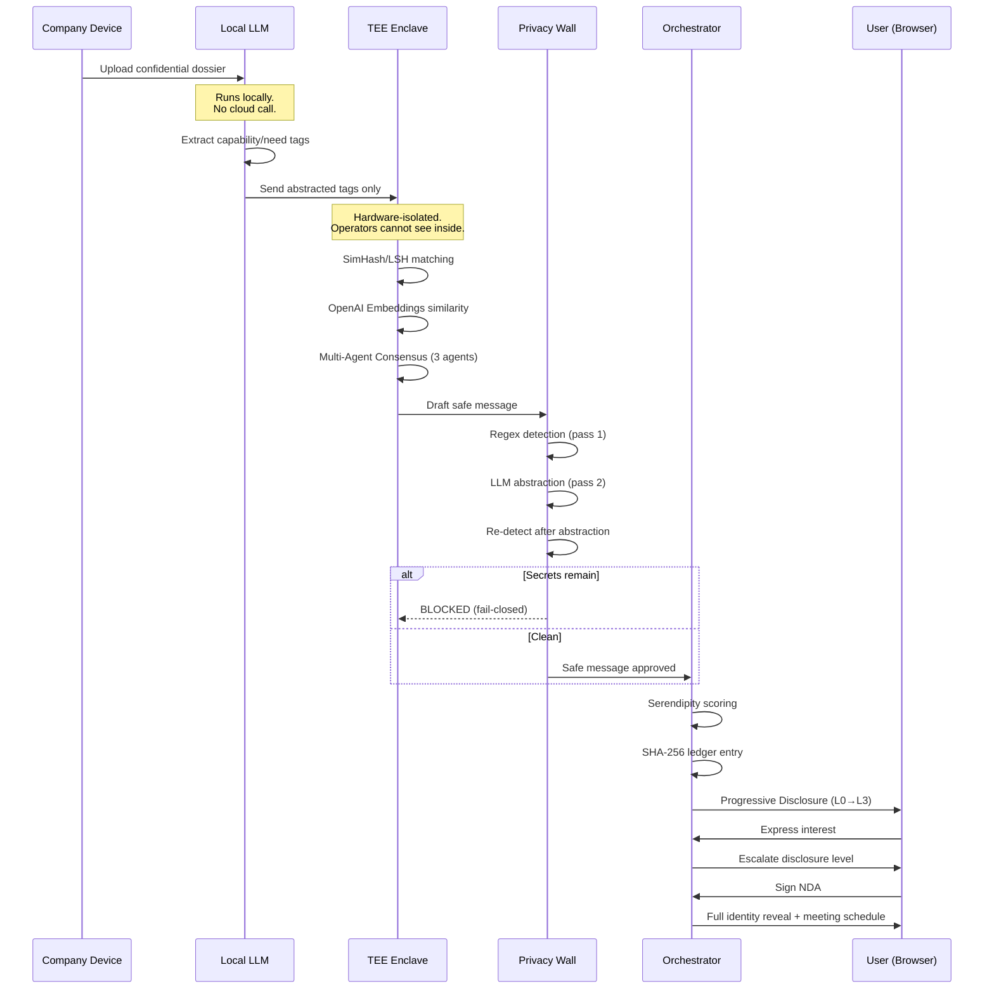
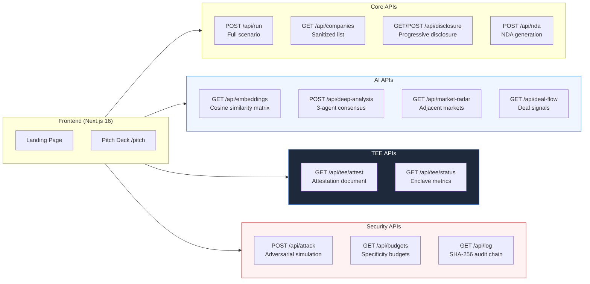

# Serendipity — Technical Architecture

## System Overview

```mermaid
graph TB
    subgraph CLIENT["Client (Browser)"]
        UI[Landing Page / Pitch Deck]
        DEMO[Live Demo Interface]
    end

    subgraph LOCAL["Local Device (Per Company)"]
        DATA[Company Secrets<br/>R&D plans, budgets,<br/>org charts, dossiers]
        OLLAMA[Local LLM<br/>Ollama / gpt-4o-mini]
        TAGS[Abstracted Capability Tags<br/>Never raw secrets]
        DATA --> OLLAMA --> TAGS
    end

    subgraph TEE["TEE Secure Match Room<br/>(Intel SGX / AMD SEV / AWS Nitro)"]
        direction TB

        subgraph AGENTS["AI Company Agents"]
            A1[MegaCorp Agent<br/>Japan / Automotive]
            A2[AltaiMaterials Agent<br/>Kazakhstan / Ceramics]
            A3[NanoShield Agent<br/>China / Deep-Sea]
            A4[BioWrap Agent<br/>Japan / Medical]
        end

        subgraph MATCHING["Matching Engine"]
            LSH[SimHash / LSH<br/>Feature-hashing +<br/>Hyperplane projection]
            EMB[OpenAI Embeddings<br/>text-embedding-3-small<br/>256-dim vectors]
            SEREN[Serendipity Score<br/>novelty + utility - penalty]
            LSH --> SEREN
            EMB --> SEREN
        end

        subgraph CONSENSUS["Multi-Agent Consensus"]
            DEAL[Deal Analyst<br/>Market size, revenue,<br/>strategic fit]
            TECHDD[Tech DD Agent<br/>Technology readiness,<br/>IP landscape]
            CROSS[Cross-Border Agent<br/>Geopolitics, regulation,<br/>supply chain]
        end

        subgraph SAFETY["Safety Layer"]
            WALL[Privacy Wall<br/>Regex + LLM dual pass<br/>Fail-closed]
            MOD[OpenAI Moderation<br/>omni-moderation-latest]
            BUDGET[Specificity Budget<br/>Anti-reconstruction guard]
        end

        AGENTS --> MATCHING
        MATCHING --> CONSENSUS
        CONSENSUS --> SAFETY
    end

    subgraph OUTPUT["Safe Output Only"]
        DISC[Progressive Disclosure<br/>L0 → L1 → L2 → L3]
        NDA[NDA Generation]
        SCHEDULE[Meeting Schedule<br/>Who / Why / When / Where]
        LEDGER[SHA-256 Audit Ledger<br/>Tamper-evident hash chain]
    end

    subgraph HUB["Intelligence Hub (Future)"]
        RADAR[Market Radar<br/>Cross-industry scanning]
        DEALFLOW[Deal Intelligence<br/>Signal tracking, warm intros]
        COMPETE[Competitive Sensing<br/>Private market monitoring]
    end

    TAGS --> TEE
    TEE --> OUTPUT
    OUTPUT --> CLIENT
    OUTPUT --> HUB

    style TEE fill:#1e293b,stroke:#3b82f6,stroke-width:3px,color:#fff
    style LOCAL fill:#f0fdf4,stroke:#16a34a,stroke-width:2px
    style SAFETY fill:#fef2f2,stroke:#dc2626,stroke-width:2px
    style CONSENSUS fill:#eff6ff,stroke:#2563eb,stroke-width:2px
    style HUB fill:#faf5ff,stroke:#9333ea,stroke-width:2px
```

## Data Flow

## API Architecture

## Technology Matrix

| Layer | Technology | Purpose |
|-------|-----------|---------|
| **Execution** | Intel SGX / AMD SEV / AWS Nitro | Hardware-isolated trusted computation |
| **Agent Reasoning** | OpenAI GPT-4o-mini | Multi-agent drafting, critique, synthesis |
| **Embeddings** | OpenAI text-embedding-3-small | 256-dim vector similarity for capability matching |
| **Content Safety** | OpenAI omni-moderation-latest | Content safety verification layer |
| **Matching** | SimHash / LSH | Feature-hashing with hyperplane projection |
| **Audit** | SHA-256 Hash Chain | Tamper-evident cryptographic audit log |
| **Privacy** | Regex + LLM Dual Pass | Two-stage detection and abstraction |
| **Anti-Reconstruction** | Specificity Budget | Prevents gradual secret reconstruction |
| **Disclosure** | Progressive L0-L3 | Step-by-step trust-building information reveal |
| **Local Processing** | Ollama (fallback) | Offline LLM for zero-cloud operation |
| **Frontend** | Next.js 16 + Tailwind | App Router, TypeScript, responsive UI |
| **Deploy** | Vercel | Auto-deploy from main branch |
